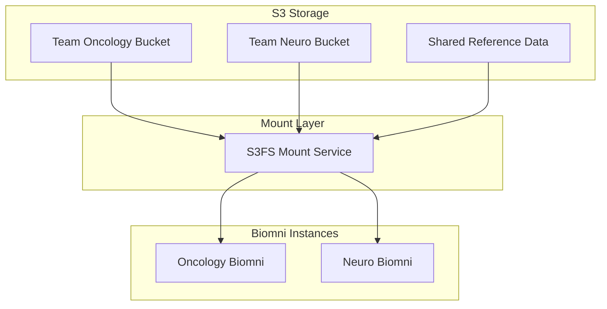

# NIBR Data Layer Architecture

## Overview

The Data Layer enables Biomni deployment at enterprise scale by providing virtualized data access through S3 bucket mounting. This allows multiple research teams to access different data combinations without local storage management.

## Key Concepts

### The Problem
- Biomni expects a single 11GB dataset per instance
- NIBR has 100+ teams needing different data combinations
- Each team would need 50-100GB custom datasets without the Data Layer

### The Solution
- Mount team-specific S3 buckets as local filesystems
- Biomni reads "local" files that are actually S3-mounted
- No code changes to Biomni required
- Teams share common datasets efficiently

## Architecture



## Configuration

### Team-Specific Mounts

```yaml
# s3-mount-config.yml
oncology_team:
  mounts:
    - source: "s3://nibr-oncology/genomics"
      target: "/biomni_data/data_lake/genomics"
      options: "ro,cache"
    
    - source: "s3://nibr-shared/reference"
      target: "/biomni_data/data_lake/reference"
      options: "ro,cache,shared"

neuroscience_team:
  mounts:
    - source: "s3://nibr-neuro/imaging"
      target: "/biomni_data/data_lake/imaging"
      options: "ro,cache"
```

### Local Development Setup

For local development, we simulate the Data Layer with direct filesystem mounts:

```bash
# Download data once
cd nibr/scripts
./download-data.sh

# Mount in container
docker run -v $(pwd)/data:/biomni_data biomni:nibr
```

## Implementation Phases

### Phase 1: Local Mount (Current)
- Direct filesystem mounting for development
- 11GB dataset on local Mac
- No S3 dependencies

### Phase 2: S3 Integration (Next)
- S3FS installation and configuration
- Team-specific bucket creation
- Credential management via IAM

### Phase 3: Enterprise Scale (Future)
- Multi-team orchestration
- Shared cache layers
- Result registry for cross-team collaboration

## Performance Considerations

| Data Access Method | Latency | Throughput | Cost |
|-------------------|---------|------------|------|
| Local Mount | <1ms | SSD speed | Free |
| S3 Mount (cached) | 10ms | 100MB/s | Low |
| S3 Mount (uncached) | 100ms | 50MB/s | Medium |

## S3 Mount Setup (Future)

```bash
# Install S3FS
apt-get install s3fs

# Configure credentials
echo ACCESS_KEY:SECRET_KEY > ~/.passwd-s3fs
chmod 600 ~/.passwd-s3fs

# Mount S3 bucket
s3fs nibr-team /biomni_data/data_lake \
  -o passwd_file=~/.passwd-s3fs \
  -o allow_other \
  -o use_cache=/tmp/cache \
  -o ensure_diskfree=1000
```

## Benefits

1. **Zero Code Changes**: Biomni works unmodified
2. **Dynamic Data**: Teams access different data without rebuilding
3. **Cost Efficient**: Shared storage, no duplication
4. **Scalable**: Supports 100+ teams with same infrastructure
5. **Performance**: Local caching minimizes S3 access

## Next Steps

1. Complete local development setup ✅
2. Test S3FS mounting with sample buckets
3. Create team-specific bucket configurations
4. Implement credential rotation
5. Deploy multi-team pilot

## Resources

- [S3FS Documentation](https://github.com/s3fs-fuse/s3fs-fuse)
- [AWS EFS Alternative](https://aws.amazon.com/efs/)
- [Biomni Data Requirements](../docs/data-requirements.md)