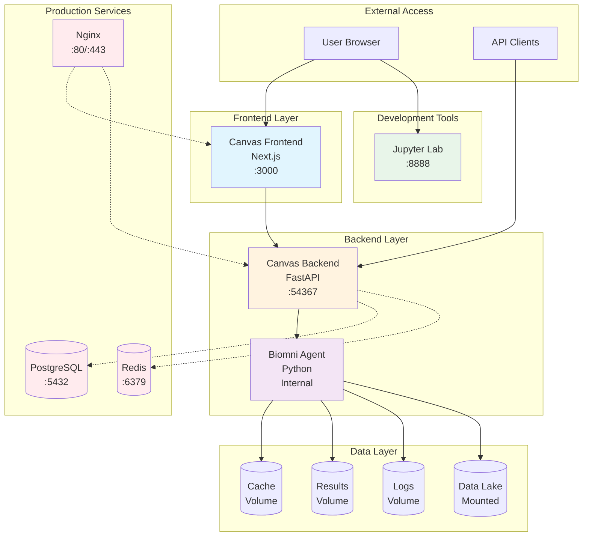

# Container Architecture

## Overview

The NIBR Biomni stack is composed of multiple containerized services orchestrated using Docker Compose. The architecture follows a microservices pattern with clear separation of concerns.



## Service Components

### Core Services

#### 1. Biomni Agent (`biomni-agent`)
- **Purpose**: Core AI agent for biomedical research tasks
- **Base Image**: Custom multi-stage build from `nibr/biomni:latest`
- **Key Features**:
  - LLM integration (OpenAI, Anthropic, Azure, Google, Groq)
  - Tool registry for biomedical operations
  - Persistent state management
  - MCP protocol support
- **Resources**:
  - CPU: 2-4 cores
  - Memory: 4-8GB
- **Volumes**:
  - `/biomni_data/data_lake`: Read-only data lake
  - `/biomni_data/cache`: Agent cache
  - `/biomni_data/results`: Output results
  - `/biomni_data/logs`: Application logs

#### 2. Canvas Backend (`canvas-backend`)
- **Purpose**: REST API server for Canvas UI
- **Base Image**: Python 3.11 with FastAPI
- **Port**: 54367
- **Key Features**:
  - Agent orchestration
  - Session management
  - File operations
  - WebSocket support for real-time updates
- **Resources**:
  - CPU: 1-2 cores
  - Memory: 2-4GB
- **Dependencies**: biomni-agent

#### 3. Canvas Frontend (`canvas-frontend`)
- **Purpose**: Web-based user interface
- **Base Image**: Node.js 20 Alpine
- **Port**: 3000
- **Key Features**:
  - Next.js 14 framework
  - Real-time agent interaction
  - File browser and editor
  - Markdown rendering
  - Authentication support
- **Resources**:
  - CPU: 1-2 cores
  - Memory: 1-2GB
- **Dependencies**: canvas-backend

### Development Services

#### 4. Jupyter Lab (`biomni-jupyter`)
- **Purpose**: Interactive development environment
- **Base Image**: Custom build with scientific packages
- **Port**: 8888
- **Profile**: `dev`
- **Access URL**: http://localhost:8888?token=biomni
- **Features**:
  - Direct biomni library access
  - Tutorial notebooks
  - Data exploration tools
- **Default Token**: `biomni`
- **Environment Variable**: `JUPYTER_TOKEN=biomni`

### Production Services (Optional)

#### 5. PostgreSQL (`postgres`)
- **Purpose**: Persistent database for production
- **Port**: 5432
- **Profile**: `production`
- **Version**: 15-alpine
- **Default Credentials**:
  - User: `biomni`
  - Password: `biomni-password`
  - Database: `biomni_canvas`

#### 6. Redis (`redis`)
- **Purpose**: Caching and session storage
- **Port**: 6379
- **Profile**: `production`
- **Version**: 7-alpine
- **Configuration**:
  - Max memory: 512MB
  - Eviction policy: allkeys-lru

#### 7. Nginx (`nginx`)
- **Purpose**: Reverse proxy and load balancer
- **Ports**: 80, 443
- **Profile**: `production`
- **Features**:
  - SSL termination
  - Static file serving
  - Request routing

## Container Images

### Base Images
- **biomni:latest**: Production build with core dependencies
- **biomni:dev**: Development build with Jupyter and debugging tools
- **canvas-backend:latest**: FastAPI backend
- **canvas-frontend:latest**: Next.js frontend

### Build Targets
Each Dockerfile supports multiple build targets:

```dockerfile
# Biomni Dockerfile targets
- base: Core dependencies
- production: Optimized runtime
- development: Includes Jupyter and dev tools

# Canvas Dockerfiles
- Single-stage optimized builds for each service
```

## Volume Management

### Named Volumes
- `biomni-cache`: Agent computation cache
- `biomni-results`: Analysis outputs
- `biomni-logs`: Application logs
- `canvas-data`: Backend persistent data
- `canvas-logs`: Backend logs
- `canvas-uploads`: User uploaded files
- `postgres-data`: Database storage
- `redis-data`: Cache persistence
- `nginx-cache`: HTTP cache
- `nginx-logs`: Access and error logs

### Bind Mounts
- `${BIOMNI_LOCAL_DATA_PATH}/data_lake`: Read-only biomedical data
- `${BIOMNI_LOCAL_DATA_PATH}/benchmark`: Benchmark datasets
- `./agents`: Agent wrapper scripts
- `./src`: Source code for development

## Health Checks

Each service implements health checks for orchestration:

```yaml
# Biomni Agent
healthcheck:
  test: ["CMD", "echo", "OK"]
  interval: 60s
  timeout: 30s
  retries: 3
  start_period: 120s

# Canvas Backend
healthcheck:
  test: ["CMD", "curl", "-f", "http://localhost:54367/health"]
  interval: 30s
  timeout: 5s
  retries: 3

# PostgreSQL
healthcheck:
  test: ["CMD-SHELL", "pg_isready -U biomni"]
  interval: 10s
  timeout: 5s
  retries: 5
```

## Resource Limits

Production deployment resource constraints:

| Service | CPU Limit | Memory Limit | CPU Reserve | Memory Reserve |
|---------|-----------|--------------|-------------|----------------|
| biomni-agent | 4 cores | 8GB | 2 cores | 4GB |
| canvas-backend | 2 cores | 4GB | 1 core | 2GB |
| canvas-frontend | 2 cores | 2GB | 1 core | 1GB |

## Security Considerations

1. **Network Isolation**: All services communicate through internal Docker network
2. **Read-only Mounts**: Data lake mounted as read-only to prevent corruption
3. **Environment Variables**: Sensitive data passed via environment variables
4. **Non-root Users**: Containers run with limited privileges where possible
5. **Health Checks**: Automatic container restart on failure