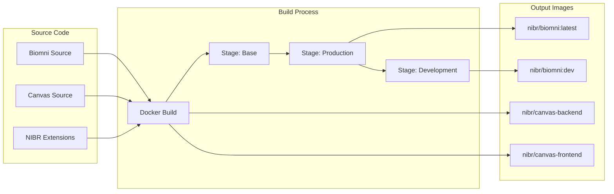

# Container Build Process

## Overview

This document describes the build process for all containers in the NIBR Biomni stack, including multi-stage builds, optimization techniques, and troubleshooting.

## Build Architecture



## Dockerfiles

### 1. Biomni Agent (`docker/Dockerfile.nibr`)

Multi-stage build optimized for both production and development:

```dockerfile
# Stage 1: Base
FROM python:3.11-slim AS base
- Install system dependencies
- Create application user
- Set working directory

# Stage 2: Production
FROM base AS production
- Copy requirements
- Install Python packages
- Copy application code
- Set production environment

# Stage 3: Development
FROM production AS development
- Install Jupyter and development tools
- Enable debugging capabilities
- Expose additional ports
```

**Build Commands:**
```bash
# Production build
docker build \
  --target production \
  -f docker/Dockerfile.nibr \
  -t nibr/biomni:latest \
  ..

# Development build
docker build \
  --target development \
  -f docker/Dockerfile.nibr \
  -t nibr/biomni:dev \
  ..
```

### 2. Canvas Backend (`canvas/Dockerfile.backend.dev`)

FastAPI application with hot-reload support:

```dockerfile
FROM python:3.11-slim
- Install system dependencies
- Copy requirements
- Install Python packages
- Copy application code
- Configure FastAPI
```

**Build Command:**
```bash
docker build \
  -f canvas/Dockerfile.backend.dev \
  -t nibr/canvas-backend:latest \
  canvas/
```

### 3. Canvas Frontend (`canvas/Dockerfile.frontend.dev`)

Next.js application with development server:

```dockerfile
FROM node:20-alpine
- Install build dependencies
- Handle package manager detection
- Install node modules
- Copy application code
- Configure Next.js
```

**Build Command:**
```bash
docker build \
  -f canvas/Dockerfile.frontend.dev \
  -t nibr/canvas-frontend:latest \
  canvas/
```

## Build Script

The `rebuild-containers.sh` script automates the build process:

### Usage
```bash
# Rebuild all containers
./rebuild-containers.sh --all

# Rebuild specific services
./rebuild-containers.sh --biomni --backend

# Force rebuild (remove images)
./rebuild-containers.sh --all --force

# Clean rebuild (remove volumes)
./rebuild-containers.sh --all --clean

# Rebuild and start services
./rebuild-containers.sh --all --start

# Use development profile
./rebuild-containers.sh --jupyter --dev --start
```

### Script Options
| Option | Short | Description |
|--------|-------|-------------|
| --all | -a | Rebuild all containers |
| --biomni | -b | Rebuild Biomni agent |
| --jupyter | -j | Rebuild Jupyter container |
| --backend | -k | Rebuild Canvas backend |
| --frontend | -f | Rebuild Canvas frontend |
| --force | -F | Force rebuild (remove images) |
| --clean | -C | Clean rebuild (remove volumes) |
| --start | -s | Start services after rebuild |
| --dev | | Use development profile |
| --prod | | Use production profile |

## Build Optimization

### 1. Layer Caching
- Order Dockerfile commands from least to most frequently changing
- Copy requirements before source code
- Use specific COPY commands instead of copying everything

### 2. Multi-stage Builds
- Separate build and runtime dependencies
- Reduce final image size
- Share common layers between stages

### 3. .dockerignore
Exclude unnecessary files from build context:
```
node_modules/
.git/
*.log
.env
__pycache__/
*.pyc
.pytest_cache/
```

### 4. Build Arguments
Use build arguments for flexibility:
```bash
docker build \
  --build-arg PYTHON_VERSION=3.11 \
  --build-arg NODE_VERSION=20 \
  -t nibr/biomni:custom \
  .
```

## Dependency Management

### Python Dependencies
Requirements files are organized by purpose:
- `requirements.txt`: Core dependencies
- `requirements-dev.txt`: Development tools
- `requirements-test.txt`: Testing frameworks

### Node Dependencies
Package management strategy:
1. Check for `package-lock.json` (npm)
2. Fall back to `yarn.lock` (yarn)
3. Default to `npm install`

## Build Troubleshooting

### Common Issues

#### 1. Missing Build Context
**Error**: "COPY failed: file not found"
**Solution**: Ensure build context is correct:
```bash
# Build from parent directory
cd /path/to/biomni
docker build -f nibr/docker/Dockerfile.nibr .
```

#### 2. Stage Not Found
**Error**: "target stage 'development' could not be found"
**Solution**: Verify stage name in Dockerfile:
```dockerfile
FROM base AS development  # Stage name must match
```

#### 3. Port Conflicts
**Error**: "bind: address already in use"
**Solution**: Check and stop conflicting services:
```bash
lsof -i :3000  # Find process using port
kill <PID>     # Stop the process
```

#### 4. Package Lock Conflicts
**Error**: "Your lockfile needs to be updated"
**Solution**: Update Dockerfile to handle mixed package managers:
```dockerfile
RUN if [ -f package-lock.json ]; then \
      npm ci; \
    elif [ -f yarn.lock ]; then \
      yarn install; \
    else \
      npm install; \
    fi
```

## Build Performance

### Metrics
Typical build times on standard hardware:

| Container | Initial Build | Cached Build | Image Size |
|-----------|--------------|--------------|------------|
| biomni:latest | 5-7 min | 30-60 sec | 1.2 GB |
| biomni:dev | 7-10 min | 45-90 sec | 1.8 GB |
| canvas-backend | 2-3 min | 15-30 sec | 450 MB |
| canvas-frontend | 3-5 min | 20-40 sec | 380 MB |

### Optimization Tips
1. **Use BuildKit**: Enable Docker BuildKit for parallel builds
   ```bash
   DOCKER_BUILDKIT=1 docker build .
   ```

2. **Prune Regularly**: Remove unused build cache
   ```bash
   docker builder prune -a
   ```

3. **Use Registry Cache**: Pull base images before building
   ```bash
   docker pull python:3.11-slim
   ```

## CI/CD Integration

### GitHub Actions Example
```yaml
- name: Build Biomni Container
  run: |
    docker build \
      --target production \
      --cache-from nibr/biomni:latest \
      -t nibr/biomni:${{ github.sha }} \
      -f nibr/docker/Dockerfile.nibr \
      .
```

### Build Versioning
Tag images with semantic versions:
```bash
docker build -t nibr/biomni:latest -t nibr/biomni:1.5.0 .
```